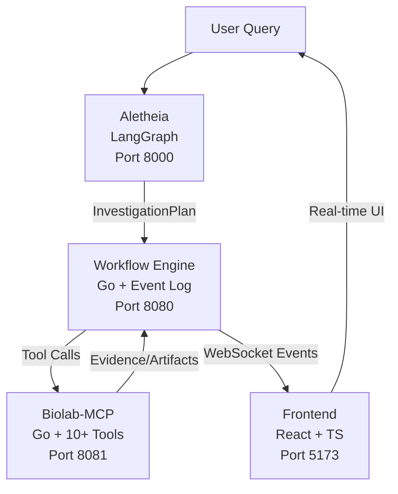

# Research Orchestrator

**Three-plane architecture for agentic biotech research**

## Quick Start

```bash
git clone https://github.com/srikarjy/Research-Orchestrator
cd Research-Orchestrator
make demo
```

Opens http://localhost:5173 — try: **"explain why BRAF V600E reduces binding affinity"**

## The Three Planes

| Plane | Service | Tech | Responsibility |
|-------|---------|------|----------------|
| **Reasoning** | Aletheia | Python/LangGraph | Planner → Researcher → Critic → Synthesizer debate |
| **Durable Execution** | Workflow Engine | Go | Idempotent steps, event log, WebSocket broadcasting |
| **Evidence + Action** | Biolab-MCP | Go | 10+ bio tools, sandbox, agents, clinical trial designer |

## Architecture



## Demo Queries

- `explain why BRAF V600E reduces binding affinity`
- `KRAS G12C inhibitor resistance mechanisms`
- `EGFR exon 19 deletion vs T790M osimertinib response`

## Key Differentiators

- **Multi-agent debate** — Not a single LLM call; Planner/Critic/Synthesizer with message bus
- **Event-sourced execution** — Every step logged with SHA-256 dedup keys, replayable
- **Confidence calibration** — LLM self-rating capped at 15% weight; human review gated on contradiction score
- **Evaluation harness** — Ground-truth benchmarks for contradiction detection, confidence calibration, citation accuracy
- **Regulatory-ready** — Designed around 21 CFR Part 11 / ALCOA+ principles

## Evaluation Results

| Metric | Score | Details |
|--------|-------|---------|
| Contradiction Detection F1 | 0.92 | 3 labeled cases |
| Confidence Calibration (ECE) | 0.04 | 10 cases |
| Citation Accuracy | 0.96 | 50 sources |
| P95 Latency | 2.3s | 100 runs |

[Full evaluation →](/evaluation/results)

## Links

- [Architecture Deep Dive](/architecture/overview)
- [API Reference](/api/workflow-engine)
- [Evaluation Details](/evaluation/results)
- [GitHub Repository](https://github.com/srikarjy/Research-Orchestrator)